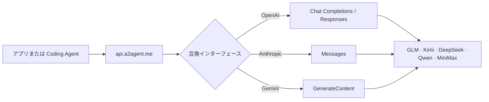

<div align="center">

# ⚡ A2Agent

### 1 つの API で GLM、Kimi、DeepSeek、Qwen、MiniMax へ

OpenAI、Anthropic、Gemini 互換インターフェースを使い、プロバイダーごとにクライアントを書き直すことなく主要 AI モデルを利用できます。

[English](README.md) · [简体中文](README.zh-CN.md) · [日本語](README.ja.md) · [한국어](README.ko.md)

[](https://a2agent.me/)
[](https://docs.a2agent.me/)
[](https://a2agent.me/models)
[](https://a2agent.me/status)

<br/>

[](https://a2agent.me/)

<br/>

**1 つのキー · 3 種類の API 形式 · 5 つのモデルファミリー · 1 つの最新カタログ**

[API キーを取得](https://a2agent.me/dashboard) · [モデルを見る](https://a2agent.me/models) · [料金を比較](https://a2agent.me/pricing)

</div>

<table>
  <tr>
    <td align="right"><b>🚀 はじめる</b></td>
    <td align="center"><a href="#quick-start">クイックスタート</a></td>
    <td align="center"><a href="https://a2agent.me/models">モデル一覧</a></td>
    <td align="center"><a href="https://a2agent.me/pricing">料金</a></td>
  </tr>
  <tr>
    <td align="right"><b>🧭 知る</b></td>
    <td align="center"><a href="#why-a2agent">A2Agent を選ぶ理由</a></td>
    <td align="center"><a href="#how-it-works">仕組み</a></td>
    <td align="center"><a href="#model-families">モデルファミリー</a></td>
  </tr>
  <tr>
    <td align="right"><b>🔌 開発する</b></td>
    <td align="center"><a href="#compatible-interfaces">互換インターフェース</a></td>
    <td align="center"><a href="#coding-agent-integrations">Coding Agent 連携</a></td>
    <td align="center"><a href="https://docs.a2agent.me/">ドキュメント</a></td>
  </tr>
  <tr>
    <td align="right"><b>🛡️ 信頼性</b></td>
    <td align="center"><a href="https://a2agent.me/status">稼働状況</a></td>
    <td align="center"><a href="https://a2agent.me/privacy">プライバシー</a></td>
    <td align="center"><a href="#trust-and-operations">運用情報</a></td>
  </tr>
</table>

## ✨ A2Agent でできること

| 統一エンドポイント | 使い慣れたインターフェース | 最新情報 | Agent 対応 |
| --- | --- | --- | --- |
| `https://api.a2agent.me` から対応モデルへアクセス | OpenAI Chat Completions / Responses、Anthropic Messages、Gemini GenerateContent | 公開されたモデル機能、現在の料金、サービス稼働状況 | 主要な Coding Agent と API クライアント向けガイド |

- **SDK を変えずにモデルを切り替え。** アプリがすでに利用しているクライアントを保ち、対応するモデル ID を選択できます。
- **最低利用額なし。** 個人開発者は従量課金で始められ、より高い同時実行数や利用量には法人向けオプションがあります。
- **導入前に確認可能。** 公開ページでコンテキスト長、機能、入出力料金、チャネル状況を確認できます。
- **シンプルな認証情報管理。** 1 つの A2Agent API キーを環境変数または認証情報ストアで管理します。

> [!NOTE]
> A2Agent は Omnimodel Technology Limited が提供するマルチモデル API ゲートウェイです。Agent2Agent（A2A）プロトコルとは関係ありません。

<a id="why-a2agent"></a>

## 🤔 A2Agent を選ぶ理由

| よくある課題 | A2Agent なら |
| --- | --- |
| プロバイダーごとに SDK とリクエスト形式が異なる | OpenAI、Anthropic、Gemini 互換インターフェースを利用 |
| モデル変更のたびにアプリのコード修正が必要 | 同じエンドポイントのまま、別の対応モデル ID を選択 |
| 料金と稼働状況が複数サイトに分散している | 公開された[モデル一覧](https://a2agent.me/models)、[料金](https://a2agent.me/pricing)、[稼働状況](https://a2agent.me/status)を参照 |
| Coding ツールごとに設定方法を調べる必要がある | Claude Code、Codex CLI、Cline、Roo Code、Kilo Code、Cursor 専用ガイドを提供 |
| 本番チームには単純なモデル API 以上の機能が必要 | 法人向けに高い同時実行数、リクエスト頻度、大口料金、サポートの選択肢を提供 |

<a id="how-it-works"></a>

## 🔄 仕組み



1. [ダッシュボード](https://a2agent.me/dashboard)でアカウントと API キーを作成します。
2. 既存クライアントの接続先を `https://api.a2agent.me` に設定します。
3. [最新のモデル一覧](https://a2agent.me/models)から利用可能なモデル ID を選びます。
4. リクエストを送信し、[稼働状況ページ](https://a2agent.me/status)でサービス状態を確認します。

<a id="model-families"></a>

## 🧠 モデルファミリー

| モデルファミリー | 主な用途 | 詳細 |
| --- | --- | --- |
| **Z.ai の GLM** | コーディング、推論、Agent、一般的なチャット | [GLM モデルを見る](https://a2agent.me/models) |
| **Moonshot AI の Kimi** | 長いコンテキスト、コーディング、Agent ワークフロー | [Kimi モデルを見る](https://a2agent.me/models) |
| **DeepSeek** | 推論とコストを重視する一般的な処理 | [DeepSeek モデルを見る](https://a2agent.me/models) |
| **Alibaba Cloud の Qwen** | 多言語、画像、推論、一般的なチャット | [Qwen モデルを見る](https://a2agent.me/models) |
| **MiniMax** | Agent、推論、長いコンテキストを扱う処理 | [MiniMax モデルを見る](https://a2agent.me/models) |

モデルの提供状況、コンテキスト長、機能、料金は変更される場合があります。[最新のモデル一覧](https://a2agent.me/models)と[料金ページ](https://a2agent.me/pricing)を基準としてください。

<a id="quick-start"></a>

## ⚡ クイックスタート

API キーを作成し、最初の OpenAI 互換リクエストを送信します。

```bash
curl https://api.a2agent.me/v1/chat/completions \
  -H "Authorization: Bearer YOUR_A2AGENT_KEY" \
  -H "Content-Type: application/json" \
  -d '{
    "model": "YOUR_MODEL_ID",
    "messages": [{"role": "user", "content": "このコードを説明してください。"}]
  }'
```

アカウントで現在利用可能なモデル ID を取得します。

```bash
curl https://api.a2agent.me/v1/models \
  -H "Authorization: Bearer YOUR_A2AGENT_KEY"
```

<details>
<summary><b>OpenAI SDK を使う Python の例</b></summary>

```python
import os
from openai import OpenAI

client = OpenAI(
    api_key=os.environ["A2AGENT_API_KEY"],
    base_url="https://api.a2agent.me/v1",
)

response = client.chat.completions.create(
    model="YOUR_MODEL_ID",
    messages=[{"role": "user", "content": "Hello from A2Agent!"}],
)

print(response.choices[0].message.content)
```

</details>

<details>
<summary><b>OpenAI SDK を使う Node.js の例</b></summary>

```javascript
import OpenAI from "openai";

const client = new OpenAI({
  apiKey: process.env.A2AGENT_API_KEY,
  baseURL: "https://api.a2agent.me/v1",
});

const response = await client.chat.completions.create({
  model: "YOUR_MODEL_ID",
  messages: [{ role: "user", content: "Hello from A2Agent!" }],
});

console.log(response.choices[0].message.content);
```

</details>

<a id="compatible-interfaces"></a>

## 🔌 互換インターフェース

| インターフェース | エンドポイント | 主なクライアント |
| --- | --- | --- |
| OpenAI Chat Completions | `POST /v1/chat/completions` | OpenAI SDK、Cline、Roo Code、Kilo Code、Cursor |
| OpenAI Responses | `POST /v1/responses` | Codex CLI と Responses API 互換アプリ |
| Anthropic Messages | `POST /v1/messages` | Claude Code と Anthropic 互換アプリ |
| Gemini GenerateContent | `POST /v1beta/models/{model}:generateContent` | Gemini 互換アプリ |
| モデル検出 | `GET /v1/models` | 実行時にモデル一覧を取得するクライアント |

ストリーミング、ツール呼び出し、画像などの対応状況は、選択したモデルと上流プラットフォームによって異なります。必要な機能は[モデル一覧](https://a2agent.me/models)で確認してください。

<a id="coding-agent-integrations"></a>

## 🤖 Coding Agent 連携

<table>
  <tr>
    <td width="33%"><b>Claude Code</b><br/>Anthropic Messages 互換の設定。<br/><a href="https://a2agent.me/integrations/claude-code">ガイドを開く →</a></td>
    <td width="33%"><b>Codex CLI</b><br/>OpenAI Responses API の設定。<br/><a href="https://a2agent.me/integrations/codex-cli">ガイドを開く →</a></td>
    <td width="33%"><b>Cline</b><br/>OpenAI 互換プロバイダーの設定。<br/><a href="https://a2agent.me/integrations/cline">ガイドを開く →</a></td>
  </tr>
  <tr>
    <td><b>Roo Code</b><br/>カスタムプロバイダーの設定。<br/><a href="https://a2agent.me/integrations/roo-code">ガイドを開く →</a></td>
    <td><b>Kilo Code</b><br/>OpenAI 互換の設定。<br/><a href="https://a2agent.me/integrations/kilo-code">ガイドを開く →</a></td>
    <td><b>Cursor</b><br/>カスタム API エンドポイントの設定。<br/><a href="https://a2agent.me/integrations/cursor">ガイドを開く →</a></td>
  </tr>
</table>

バージョン管理されたサンプルと互換性テストは [`A2agent-ai/a2agent-integrations`](https://github.com/A2agent-ai/a2agent-integrations) を参照してください。

<a id="trust-and-operations"></a>

## 🛡️ 信頼性と運用情報

| 項目 | 公開情報 |
| --- | --- |
| **サービス稼働状況** | [稼働状況ページ](https://a2agent.me/status)で現在の状態、レイテンシ、過去の可用性を公開 |
| **プライバシー** | 通常の API トラフィックでは、リクエストとレスポンスの本文を意図的に永続保存しません。公開ポリシーに記載された例外があります。[プライバシーポリシー](https://a2agent.me/privacy)をご確認ください |
| **請求** | 現在のモデル料金と請求に関する説明は[料金ページ](https://a2agent.me/pricing)に掲載 |
| **法的情報** | [利用規約](https://a2agent.me/terms)と[返金ポリシー](https://a2agent.me/refund-policy)をご確認ください |
| **セキュリティ** | API キーをコミットしないでください。脆弱性は [`SECURITY.md`](https://github.com/A2agent-ai/a2agent-integrations/blob/main/SECURITY.md) の非公開報告手順に従ってください |

## 🏗️ 利用方法を選ぶ

| 個人開発者 | チーム・法人 |
| --- | --- |
| 従量課金 | 大口料金オプション |
| 最低利用額なし | より高い同時実行数とリクエスト頻度のオプション |
| 公開された連携ガイド | 連携・互換性サポート |
| 最新のモデル、料金、稼働状況 | [About ページ](https://a2agent.me/about)からチームへ問い合わせ |

## 📚 リソース

| 製品を知る | 開発する | 運用する |
| --- | --- | --- |
| [A2Agent とは？](https://a2agent.me/what-is-a2agent) | [開発者ドキュメント](https://docs.a2agent.me/) | [サービス稼働状況](https://a2agent.me/status) |
| [モデル一覧](https://a2agent.me/models) | [連携ガイド](https://a2agent.me/integrations) | [プライバシーポリシー](https://a2agent.me/privacy) |
| [料金](https://a2agent.me/pricing) | [連携リポジトリ](https://github.com/A2agent-ai/a2agent-integrations) | [利用規約](https://a2agent.me/terms) |
| [ブログ](https://a2agent.me/blog) | [llms.txt](https://a2agent.me/llms.txt) · [llms-full.txt](https://a2agent.me/llms-full.txt) | [返金ポリシー](https://a2agent.me/refund-policy) |

## 🤝 パートナーとコミュニティ

A2Agent は、オープンソースのメンテナー、Coding Agent チーム、API ツール、開発者コミュニティと協力しています。紹介・協業情報は[パートナープログラム](https://a2agent.me/partners)をご覧ください。

- 技術連携の不具合とドキュメント修正：[GitHub Issues](https://github.com/A2agent-ai/a2agent-integrations/issues)
- アカウントと請求のサポート：[About ページ](https://a2agent.me/about)に記載された連絡先をご利用ください
- 製品アップデートと技術記事：[A2Agent ブログ](https://a2agent.me/blog)

<div align="center">

### 使い慣れたインターフェースから、必要なモデルを利用できます。

[](https://a2agent.me/dashboard)

[](https://github.com/A2agent-ai/A2agent-ai)

<sub>MIT License · © A2Agent contributors</sub>

</div>
