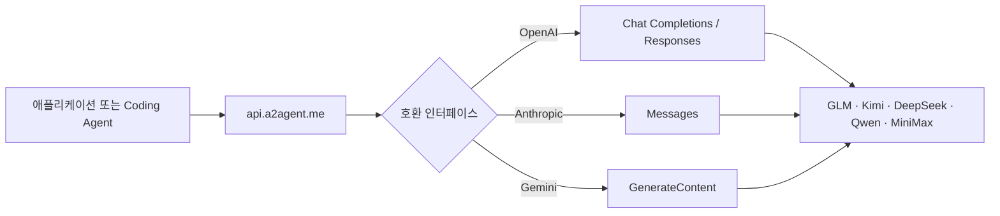

<div align="center">

# ⚡ A2Agent

### 하나의 API로 GLM, Kimi, DeepSeek, Qwen, MiniMax 사용

OpenAI, Anthropic 또는 Gemini 호환 인터페이스를 사용하여 공급자마다 클라이언트를 다시 작성하지 않고 주요 AI 모델을 이용할 수 있습니다.

[English](README.md) · [简体中文](README.zh-CN.md) · [日本語](README.ja.md) · [한국어](README.ko.md)

[](https://a2agent.me/)
[](https://docs.a2agent.me/)
[](https://a2agent.me/models)
[](https://a2agent.me/status)

<br/>

[](https://a2agent.me/)

<br/>

**하나의 키 · 세 가지 API 형식 · 다섯 가지 모델 계열 · 하나의 실시간 카탈로그**

[API 키 받기](https://a2agent.me/dashboard) · [모델 살펴보기](https://a2agent.me/models) · [요금 비교](https://a2agent.me/pricing)

</div>

<table>
  <tr>
    <td align="right"><b>🚀 시작</b></td>
    <td align="center"><a href="#quick-start">빠른 시작</a></td>
    <td align="center"><a href="https://a2agent.me/models">모델 카탈로그</a></td>
    <td align="center"><a href="https://a2agent.me/pricing">요금</a></td>
  </tr>
  <tr>
    <td align="right"><b>🧭 알아보기</b></td>
    <td align="center"><a href="#why-a2agent">A2Agent를 선택하는 이유</a></td>
    <td align="center"><a href="#how-it-works">작동 방식</a></td>
    <td align="center"><a href="#model-families">모델 계열</a></td>
  </tr>
  <tr>
    <td align="right"><b>🔌 개발</b></td>
    <td align="center"><a href="#compatible-interfaces">호환 인터페이스</a></td>
    <td align="center"><a href="#coding-agent-integrations">Coding Agent 연동</a></td>
    <td align="center"><a href="https://docs.a2agent.me/">개발자 문서</a></td>
  </tr>
  <tr>
    <td align="right"><b>🛡️ 신뢰</b></td>
    <td align="center"><a href="https://a2agent.me/status">서비스 상태</a></td>
    <td align="center"><a href="https://a2agent.me/privacy">개인정보 보호</a></td>
    <td align="center"><a href="#trust-and-operations">운영 정보</a></td>
  </tr>
</table>

## ✨ A2Agent가 제공하는 기능

| 통합 엔드포인트 | 익숙한 인터페이스 | 실시간 정보 | Agent 지원 |
| --- | --- | --- | --- |
| `https://api.a2agent.me`를 통해 지원 모델에 접근 | OpenAI Chat Completions 및 Responses, Anthropic Messages, Gemini GenerateContent | 공개된 모델 기능, 현재 요금, 서비스 상태 | 주요 Coding Agent와 API 클라이언트용 가이드 |

- **SDK를 바꾸지 않고 모델을 전환합니다.** 애플리케이션에서 이미 사용하는 클라이언트를 유지하고 지원되는 모델 ID를 선택할 수 있습니다.
- **최소 사용 금액이 없습니다.** 개인 개발자는 사용량 기반으로 시작할 수 있으며, 더 높은 동시 실행 수와 사용량이 필요한 경우 기업 옵션을 이용할 수 있습니다.
- **배포 전에 확인할 수 있습니다.** 공개 페이지에서 모델 컨텍스트, 기능, 입력/출력 요금 및 채널 상태를 확인할 수 있습니다.
- **자격 증명 관리가 간단합니다.** 하나의 A2Agent API 키를 환경 변수 또는 자격 증명 저장소에 보관합니다.

> [!NOTE]
> A2Agent는 Omnimodel Technology Limited가 제공하는 멀티 모델 API 게이트웨이입니다. Agent2Agent(A2A) 프로토콜과는 관련이 없습니다.

<a id="why-a2agent"></a>

## 🤔 A2Agent를 선택하는 이유

| 일반적인 불편 | A2Agent 사용 시 |
| --- | --- |
| 공급자마다 SDK와 요청 형식이 다름 | OpenAI, Anthropic 또는 Gemini 호환 인터페이스 사용 |
| 모델 변경 시 애플리케이션 코드도 변경해야 함 | 동일한 엔드포인트를 유지하고 다른 지원 모델 ID를 선택 |
| 요금과 가용성 정보가 여러 공급자에 분산됨 | 공개된 [모델 카탈로그](https://a2agent.me/models), [요금](https://a2agent.me/pricing), [서비스 상태](https://a2agent.me/status) 페이지 사용 |
| Coding 도구마다 별도의 설정이 필요함 | Claude Code, Codex CLI, Cline, Roo Code, Kilo Code, Cursor 전용 가이드 제공 |
| 운영 환경에는 단순한 모델 엔드포인트 이상의 기능이 필요함 | 기업 옵션에서 더 높은 동시 실행 수, 요청 빈도, 대량 요금 및 지원 제공 |

<a id="how-it-works"></a>

## 🔄 작동 방식



1. [대시보드](https://a2agent.me/dashboard)에서 계정과 API 키를 생성합니다.
2. 기존 클라이언트의 엔드포인트를 `https://api.a2agent.me`로 설정합니다.
3. [실시간 모델 카탈로그](https://a2agent.me/models)에서 사용 가능한 모델 ID를 선택합니다.
4. 요청을 전송하고 [서비스 상태 페이지](https://a2agent.me/status)에서 가용성을 확인합니다.

<a id="model-families"></a>

## 🧠 모델 계열

| 모델 계열 | 주요 용도 | 살펴보기 |
| --- | --- | --- |
| **Z.ai의 GLM** | 코딩, 추론, Agent 및 일반 채팅 | [GLM 모델 보기](https://a2agent.me/models) |
| **Moonshot AI의 Kimi** | 긴 컨텍스트, 코딩 및 Agent 워크플로 | [Kimi 모델 보기](https://a2agent.me/models) |
| **DeepSeek** | 추론 및 비용을 중시하는 일반 작업 | [DeepSeek 모델 보기](https://a2agent.me/models) |
| **Alibaba Cloud의 Qwen** | 다국어, 비전, 추론 및 일반 채팅 | [Qwen 모델 보기](https://a2agent.me/models) |
| **MiniMax** | Agent, 추론 및 긴 컨텍스트 작업 | [MiniMax 모델 보기](https://a2agent.me/models) |

모델 가용성, 컨텍스트 길이, 기능 및 요금은 변경될 수 있습니다. [실시간 모델 카탈로그](https://a2agent.me/models)와 [요금 페이지](https://a2agent.me/pricing)를 기준으로 확인하세요.

<a id="quick-start"></a>

## ⚡ 빠른 시작

API 키를 생성한 후 첫 번째 OpenAI 호환 요청을 전송합니다.

```bash
curl https://api.a2agent.me/v1/chat/completions \
  -H "Authorization: Bearer YOUR_A2AGENT_KEY" \
  -H "Content-Type: application/json" \
  -d '{
    "model": "YOUR_MODEL_ID",
    "messages": [{"role": "user", "content": "이 코드를 설명해 주세요."}]
  }'
```

계정에서 현재 사용할 수 있는 모델 ID를 조회합니다.

```bash
curl https://api.a2agent.me/v1/models \
  -H "Authorization: Bearer YOUR_A2AGENT_KEY"
```

<details>
<summary><b>OpenAI SDK를 사용하는 Python 예제</b></summary>

```python
import os
from openai import OpenAI

client = OpenAI(
    api_key=os.environ["A2AGENT_API_KEY"],
    base_url="https://api.a2agent.me/v1",
)

response = client.chat.completions.create(
    model="YOUR_MODEL_ID",
    messages=[{"role": "user", "content": "Hello from A2Agent!"}],
)

print(response.choices[0].message.content)
```

</details>

<details>
<summary><b>OpenAI SDK를 사용하는 Node.js 예제</b></summary>

```javascript
import OpenAI from "openai";

const client = new OpenAI({
  apiKey: process.env.A2AGENT_API_KEY,
  baseURL: "https://api.a2agent.me/v1",
});

const response = await client.chat.completions.create({
  model: "YOUR_MODEL_ID",
  messages: [{ role: "user", content: "Hello from A2Agent!" }],
});

console.log(response.choices[0].message.content);
```

</details>

<a id="compatible-interfaces"></a>

## 🔌 호환 인터페이스

| 인터페이스 | 엔드포인트 | 주요 클라이언트 |
| --- | --- | --- |
| OpenAI Chat Completions | `POST /v1/chat/completions` | OpenAI SDK, Cline, Roo Code, Kilo Code, Cursor |
| OpenAI Responses | `POST /v1/responses` | Codex CLI 및 Responses API 호환 애플리케이션 |
| Anthropic Messages | `POST /v1/messages` | Claude Code 및 Anthropic 호환 애플리케이션 |
| Gemini GenerateContent | `POST /v1beta/models/{model}:generateContent` | Gemini 호환 애플리케이션 |
| 모델 검색 | `GET /v1/models` | 런타임에 모델 목록을 조회하는 클라이언트 |

스트리밍, 도구 호출, 비전 및 기타 기능 지원은 선택한 모델과 업스트림 플랫폼에 따라 달라집니다. 필요한 기능은 [모델 카탈로그](https://a2agent.me/models)에서 확인하세요.

<a id="coding-agent-integrations"></a>

## 🤖 Coding Agent 연동

<table>
  <tr>
    <td width="33%"><b>Claude Code</b><br/>Anthropic Messages 호환 설정.<br/><a href="https://a2agent.me/integrations/claude-code">가이드 열기 →</a></td>
    <td width="33%"><b>Codex CLI</b><br/>OpenAI Responses API 설정.<br/><a href="https://a2agent.me/integrations/codex-cli">가이드 열기 →</a></td>
    <td width="33%"><b>Cline</b><br/>OpenAI 호환 공급자 설정.<br/><a href="https://a2agent.me/integrations/cline">가이드 열기 →</a></td>
  </tr>
  <tr>
    <td><b>Roo Code</b><br/>사용자 지정 공급자 설정.<br/><a href="https://a2agent.me/integrations/roo-code">가이드 열기 →</a></td>
    <td><b>Kilo Code</b><br/>OpenAI 호환 설정.<br/><a href="https://a2agent.me/integrations/kilo-code">가이드 열기 →</a></td>
    <td><b>Cursor</b><br/>사용자 지정 API 엔드포인트 설정.<br/><a href="https://a2agent.me/integrations/cursor">가이드 열기 →</a></td>
  </tr>
</table>

버전이 관리되는 예제와 호환성 테스트는 [`A2agent-ai/a2agent-integrations`](https://github.com/A2agent-ai/a2agent-integrations)에서 확인할 수 있습니다.

<a id="trust-and-operations"></a>

## 🛡️ 신뢰 및 운영 정보

| 항목 | 공개된 정보 |
| --- | --- |
| **서비스 상태** | [서비스 상태 페이지](https://a2agent.me/status)에서 현재 운영 상태, 지연 시간 및 과거 가용성을 제공 |
| **개인정보 보호** | 일반 API 트래픽에서는 요청 및 응답 본문을 의도적으로 영구 저장하지 않습니다. 공개된 정책에 명시된 예외가 적용될 수 있습니다. [개인정보 처리방침](https://a2agent.me/privacy)을 확인하세요 |
| **청구** | 현재 모델 요금과 청구 설명은 [요금 페이지](https://a2agent.me/pricing)에 게시 |
| **법적 정보** | [서비스 약관](https://a2agent.me/terms)과 [환불 정책](https://a2agent.me/refund-policy)을 확인하세요 |
| **보안** | API 키를 커밋하지 마세요. 취약점은 [`SECURITY.md`](https://github.com/A2agent-ai/a2agent-integrations/blob/main/SECURITY.md)의 비공개 신고 절차를 따르세요 |

## 🏗️ 사용 방식 선택

| 개인 개발자 | 팀 및 기업 |
| --- | --- |
| 사용량 기반 결제 | 대량 요금 옵션 |
| 최소 사용 금액 없음 | 더 높은 동시 실행 수와 요청 빈도 옵션 |
| 공개 연동 가이드 | 연동 및 호환성 지원 |
| 실시간 모델, 요금 및 상태 | [About 페이지](https://a2agent.me/about)를 통해 팀에 문의 |

## 📚 리소스

| 제품 알아보기 | 개발하기 | 운영하기 |
| --- | --- | --- |
| [A2Agent란?](https://a2agent.me/what-is-a2agent) | [개발자 문서](https://docs.a2agent.me/) | [서비스 상태](https://a2agent.me/status) |
| [모델 카탈로그](https://a2agent.me/models) | [연동 가이드](https://a2agent.me/integrations) | [개인정보 처리방침](https://a2agent.me/privacy) |
| [요금](https://a2agent.me/pricing) | [연동 저장소](https://github.com/A2agent-ai/a2agent-integrations) | [서비스 약관](https://a2agent.me/terms) |
| [블로그](https://a2agent.me/blog) | [llms.txt](https://a2agent.me/llms.txt) · [llms-full.txt](https://a2agent.me/llms-full.txt) | [환불 정책](https://a2agent.me/refund-policy) |

## 🤝 파트너 및 커뮤니티

A2Agent는 오픈 소스 관리자, Coding Agent 팀, API 도구 및 개발자 커뮤니티와 협력합니다. 추천 및 협업 정보는 [파트너 프로그램](https://a2agent.me/partners)을 참조하세요.

- 기술 연동 오류 및 문서 수정: [GitHub Issues](https://github.com/A2agent-ai/a2agent-integrations/issues)
- 계정 및 청구 지원: [About 페이지](https://a2agent.me/about)에 안내된 연락 채널 이용
- 제품 업데이트 및 기술 문서: [A2Agent 블로그](https://a2agent.me/blog)

<div align="center">

### 익숙한 인터페이스를 통해 작업에 필요한 모델을 사용하세요.

[](https://a2agent.me/dashboard)

[](https://github.com/A2agent-ai/A2agent-ai)

<sub>MIT License · © A2Agent contributors</sub>

</div>
