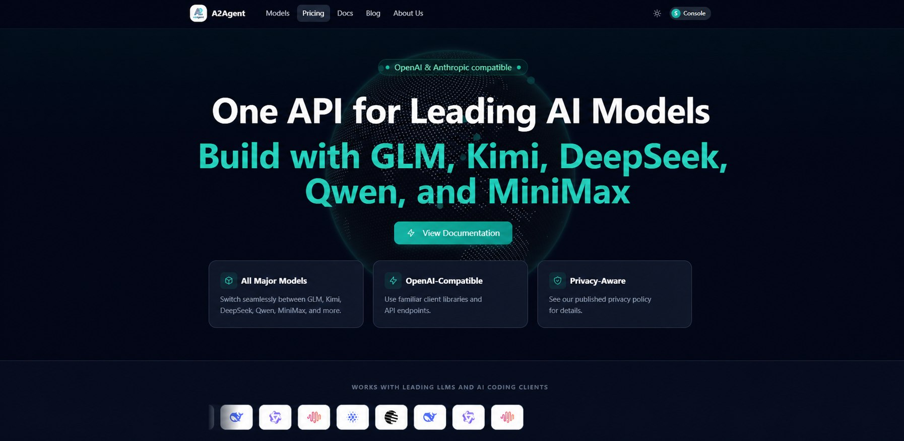

# A2Agent

**One API gateway for GLM, Kimi, DeepSeek, Qwen, and MiniMax, with OpenAI- and Anthropic-compatible endpoints.**

[Website](https://a2agent.me/) · [Documentation](https://docs.a2agent.me/) · [Model catalog](https://docs.a2agent.me/models/overview) · [Pricing](https://docs.a2agent.me/models/pricing) · [Service status](https://a2agent.me/status) · [Dashboard](https://a2agent.me/dashboard)

[](https://a2agent.me/)

## Offers for users and builders

- Eligible new accounts receive **$5 in trial API credit**.
- Supported model rates are generally **20%–50% below the corresponding upstream public API list prices**.
- Eligible subscriptions may include a **3-day free trial**.
- Selected plans currently include **$80 of usage for $60** or **$140 of usage for $100**.

[Create an account](https://a2agent.me/dashboard) or review the [current pricing page](https://docs.a2agent.me/models/pricing) before purchasing. Availability, model rates, plan benefits, and eligibility may change; the live dashboard and published program terms are authoritative.

## Partner with A2Agent

We work with open-source maintainers, coding-agent teams, API tools, and developer communities.

- Eligible referral partners may receive a **5%–10% token rebate** on qualifying referred top-ups.
- Open-source authors may receive **$20–$100 in API credits**, based on repository activity, stars, technical fit, and expected integration value.
- High-impact projects may be considered for **recurring monthly API credits** and compatibility support.
- We can help with OpenAI/Anthropic endpoint testing, streaming, tool calls, model discovery, and integration documentation.

For a technical integration, open an [Integration Request](https://github.com/A2agent-ai/a2agent-integrations/issues/new?template=integration_request.yml). For sponsorship, referral, or account-credit discussions, use the private support channel listed in the [A2Agent documentation](https://docs.a2agent.me/account/status#contacting-support). Please do not place commercial terms or private account details in a public PR.

Credits are promotional, non-transferable, and not redeemable for cash. Approval and recurring support are subject to project review and the current program terms.

## Quick start

Create an API key in the dashboard, then send an OpenAI-compatible request:

```bash
curl https://api.a2agent.me/v1/chat/completions \
  -H "Authorization: Bearer YOUR_A2AGENT_KEY" \
  -H "Content-Type: application/json" \
  -d '{
    "model": "YOUR_MODEL_ID",
    "messages": [{"role": "user", "content": "Hello!"}]
  }'
```

Retrieve the current model IDs before choosing a model:

```bash
curl https://api.a2agent.me/v1/models \
  -H "Authorization: Bearer YOUR_A2AGENT_KEY"
```

## Supported interfaces

- OpenAI Chat Completions: `POST /v1/chat/completions`
- Anthropic Messages-compatible requests
- Model discovery: `GET /v1/models`

## Client integrations

The [A2Agent integrations repository](https://github.com/A2agent-ai/a2agent-integrations) contains versioned guides, examples, and compatibility tests for:

- [Pi Coding Agent](https://github.com/A2agent-ai/a2agent-integrations/blob/main/docs/clients/pi.md)
- [Hermes Agent](https://github.com/A2agent-ai/a2agent-integrations/blob/main/docs/clients/hermes-cli.md)
- [Cline](https://github.com/A2agent-ai/a2agent-integrations/blob/main/docs/clients/cline.md)

## Privacy and security

Request bodies are not ordinarily intentionally persisted. Temporary processing, debugging, security, and legal-obligation exceptions may apply. Read the current [privacy policy](https://docs.a2agent.me/help/privacy) before sending sensitive data.

Never commit an API key. Use environment variables or your operating system's credential store.

## Support

- Technical integration bugs and documentation corrections: [GitHub Issues](https://github.com/A2agent-ai/a2agent-integrations/issues)
- Account, top-up, and billing questions: use the support channel listed in the [A2Agent documentation](https://docs.a2agent.me/account/status#contacting-support)
- Security vulnerabilities: follow the private reporting instructions in [SECURITY.md](https://github.com/A2agent-ai/a2agent-integrations/blob/main/SECURITY.md)

[简体中文](README.zh-CN.md)
