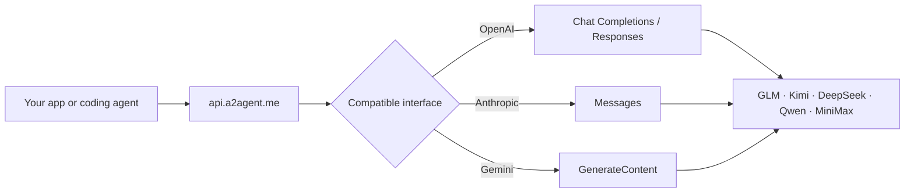

<div align="center">

# ⚡ A2Agent

### One API for GLM, Kimi, DeepSeek, Qwen, and MiniMax

Use OpenAI, Anthropic, or Gemini-compatible interfaces to build with leading AI models—without rewriting your client for every provider.

[English](README.md) · [简体中文](README.zh-CN.md) · [日本語](README.ja.md) · [한국어](README.ko.md)

[](https://a2agent.me/)
[](https://docs.a2agent.me/)
[](https://a2agent.me/models)
[](https://a2agent.me/status)

<br/>

[](https://a2agent.me/)

<br/>

**One key · Three API formats · Five model families · One live catalog**

[Get an API key](https://a2agent.me/dashboard) · [Explore models](https://a2agent.me/models) · [Compare pricing](https://a2agent.me/pricing)

</div>

<table>
  <tr>
    <td align="right"><b>🚀 Start</b></td>
    <td align="center"><a href="#-quick-start">Quick start</a></td>
    <td align="center"><a href="https://a2agent.me/models">Model catalog</a></td>
    <td align="center"><a href="https://a2agent.me/pricing">Pricing</a></td>
  </tr>
  <tr>
    <td align="right"><b>🧭 Explore</b></td>
    <td align="center"><a href="#-why-a2agent">Why A2Agent</a></td>
    <td align="center"><a href="#-how-it-works">How it works</a></td>
    <td align="center"><a href="#-model-families">Model families</a></td>
  </tr>
  <tr>
    <td align="right"><b>🔌 Build</b></td>
    <td align="center"><a href="#-compatible-interfaces">API formats</a></td>
    <td align="center"><a href="#-coding-agent-integrations">Integrations</a></td>
    <td align="center"><a href="https://docs.a2agent.me/">Documentation</a></td>
  </tr>
  <tr>
    <td align="right"><b>🛡️ Trust</b></td>
    <td align="center"><a href="https://a2agent.me/status">Service status</a></td>
    <td align="center"><a href="https://a2agent.me/privacy">Privacy</a></td>
    <td align="center"><a href="#-trust-and-operations">Operations</a></td>
  </tr>
</table>

## ✨ What A2Agent gives you

| One endpoint | Familiar interfaces | Live information | Agent-ready |
| --- | --- | --- | --- |
| Access supported models through `https://api.a2agent.me` | OpenAI Chat Completions and Responses, Anthropic Messages, and Gemini GenerateContent | Published model capabilities, current pricing, and service health | Guides for popular coding agents and API clients |

- **Switch models, not SDKs.** Keep the client your application already uses and select a supported model ID.
- **Start without a contract.** Pay-as-you-go access has no minimum spend; enterprise options cover higher concurrency and volume needs.
- **See before you ship.** Check model context, capabilities, input/output rates, and live channel health from public pages.
- **Keep credentials simple.** Use one A2Agent API key and store it in an environment variable or credential manager.

> [!NOTE]
> A2Agent is a multi-model API gateway by Omnimodel Technology Limited. It is not affiliated with the Agent2Agent (A2A) protocol.

## 🤔 Why A2Agent?

| The usual friction | With A2Agent |
| --- | --- |
| Every provider has a different SDK and request format | Use an OpenAI-, Anthropic-, or Gemini-compatible interface |
| Changing models means changing application code | Keep the same endpoint and select another supported model ID |
| Prices and availability are scattered across providers | Use the public [model catalog](https://a2agent.me/models), [pricing](https://a2agent.me/pricing), and [status](https://a2agent.me/status) pages |
| Coding tools need separate configuration | Follow focused guides for Claude Code, Codex CLI, Cline, Roo Code, Kilo Code, and Cursor |
| Production teams need more than a raw model endpoint | Enterprise options include higher concurrency, RPM, volume pricing, and support |

## 🔄 How it works



1. Create an account and API key in the [dashboard](https://a2agent.me/dashboard).
2. Point your existing client to `https://api.a2agent.me`.
3. Choose an available model ID from the [live catalog](https://a2agent.me/models).
4. Send requests and monitor availability on the [status page](https://a2agent.me/status).

## 🧠 Model families

| Provider family | Useful for | Explore |
| --- | --- | --- |
| **GLM by Z.ai** | Coding, reasoning, agents, and general chat | [View GLM models](https://a2agent.me/models) |
| **Kimi by Moonshot AI** | Long-context work, coding, and agent workflows | [View Kimi models](https://a2agent.me/models) |
| **DeepSeek** | Reasoning and cost-efficient general workloads | [View DeepSeek models](https://a2agent.me/models) |
| **Qwen by Alibaba Cloud** | Multilingual, vision, reasoning, and general chat | [View Qwen models](https://a2agent.me/models) |
| **MiniMax** | Agent, reasoning, and long-context workloads | [View MiniMax models](https://a2agent.me/models) |

Model availability, context limits, capabilities, and rates may change. The [live model catalog](https://a2agent.me/models) and [pricing page](https://a2agent.me/pricing) are authoritative.

## ⚡ Quick start

Create an API key, then make your first OpenAI-compatible request:

```bash
curl https://api.a2agent.me/v1/chat/completions \
  -H "Authorization: Bearer YOUR_A2AGENT_KEY" \
  -H "Content-Type: application/json" \
  -d '{
    "model": "YOUR_MODEL_ID",
    "messages": [{"role": "user", "content": "Explain this code."}]
  }'
```

Retrieve the model IDs available to your account:

```bash
curl https://api.a2agent.me/v1/models \
  -H "Authorization: Bearer YOUR_A2AGENT_KEY"
```

<details>
<summary><b>Python with the OpenAI SDK</b></summary>

```python
import os
from openai import OpenAI

client = OpenAI(
    api_key=os.environ["A2AGENT_API_KEY"],
    base_url="https://api.a2agent.me/v1",
)

response = client.chat.completions.create(
    model="YOUR_MODEL_ID",
    messages=[{"role": "user", "content": "Hello from A2Agent!"}],
)

print(response.choices[0].message.content)
```

</details>

<details>
<summary><b>Node.js with the OpenAI SDK</b></summary>

```javascript
import OpenAI from "openai";

const client = new OpenAI({
  apiKey: process.env.A2AGENT_API_KEY,
  baseURL: "https://api.a2agent.me/v1",
});

const response = await client.chat.completions.create({
  model: "YOUR_MODEL_ID",
  messages: [{ role: "user", content: "Hello from A2Agent!" }],
});

console.log(response.choices[0].message.content);
```

</details>

## 🔌 Compatible interfaces

| Interface | Endpoint | Typical clients |
| --- | --- | --- |
| OpenAI Chat Completions | `POST /v1/chat/completions` | OpenAI SDKs, Cline, Roo Code, Kilo Code, Cursor |
| OpenAI Responses | `POST /v1/responses` | Codex CLI and Responses-compatible applications |
| Anthropic Messages | `POST /v1/messages` | Claude Code and Anthropic-compatible applications |
| Gemini GenerateContent | `POST /v1beta/models/{model}:generateContent` | Gemini-compatible applications |
| Model discovery | `GET /v1/models` | Clients that discover models at runtime |

Support for streaming, tools, vision, and other capabilities depends on the selected model and upstream platform. Confirm the required capability in the [model catalog](https://a2agent.me/models).

## 🤖 Coding-agent integrations

<table>
  <tr>
    <td width="33%"><b>Claude Code</b><br/>Anthropic Messages-compatible setup.<br/><a href="https://a2agent.me/integrations/claude-code">Open guide →</a></td>
    <td width="33%"><b>Codex CLI</b><br/>OpenAI Responses API setup.<br/><a href="https://a2agent.me/integrations/codex-cli">Open guide →</a></td>
    <td width="33%"><b>Cline</b><br/>OpenAI-compatible provider setup.<br/><a href="https://a2agent.me/integrations/cline">Open guide →</a></td>
  </tr>
  <tr>
    <td><b>Roo Code</b><br/>Custom provider configuration.<br/><a href="https://a2agent.me/integrations/roo-code">Open guide →</a></td>
    <td><b>Kilo Code</b><br/>OpenAI-compatible configuration.<br/><a href="https://a2agent.me/integrations/kilo-code">Open guide →</a></td>
    <td><b>Cursor</b><br/>Custom API endpoint setup.<br/><a href="https://a2agent.me/integrations/cursor">Open guide →</a></td>
  </tr>
</table>

For versioned examples and compatibility tests, visit [`A2agent-ai/a2agent-integrations`](https://github.com/A2agent-ai/a2agent-integrations).

## 🛡️ Trust and operations

| Area | Published information |
| --- | --- |
| **Service health** | Live operational state, latency, and availability history on the [status page](https://a2agent.me/status) |
| **Privacy** | Request bodies are not ordinarily intentionally persisted; documented exceptions may apply. Read the [Privacy Policy](https://a2agent.me/privacy) |
| **Billing** | Current model rates and billing notes are published on the [pricing page](https://a2agent.me/pricing) |
| **Legal** | Review the [Terms of Service](https://a2agent.me/terms) and [Refund Policy](https://a2agent.me/refund-policy) |
| **Security** | Never commit API keys. Report vulnerabilities using the private process in [`SECURITY.md`](https://github.com/A2agent-ai/a2agent-integrations/blob/main/SECURITY.md) |

## 🏗️ Choose your path

| For individual developers | For teams and businesses |
| --- | --- |
| Pay as you go | Volume pricing options |
| No minimum spend | Higher concurrency and RPM options |
| Public integration guides | Integration and compatibility support |
| Live models, pricing, and status | Contact the team through the [About page](https://a2agent.me/about) |

## 📚 Resources

| Discover | Build | Operate |
| --- | --- | --- |
| [What is A2Agent?](WHAT_IS_A2AGENT.md) | [Developer documentation](https://docs.a2agent.me/) | [Service status](https://a2agent.me/status) |
| [Model catalog](https://a2agent.me/models) | [Integration guides](https://a2agent.me/integrations) | [Privacy Policy](https://a2agent.me/privacy) |
| [Pricing](https://a2agent.me/pricing) | [Integration repository](https://github.com/A2agent-ai/a2agent-integrations) | [Terms of Service](https://a2agent.me/terms) |
| [Blog](https://a2agent.me/blog) | [llms.txt](https://a2agent.me/llms.txt) · [llms-full.txt](https://a2agent.me/llms-full.txt) | [Refund Policy](https://a2agent.me/refund-policy) |

## 🤝 Partners and community

A2Agent works with open-source maintainers, coding-agent teams, API tools, and developer communities. See the [Partner Programme](https://a2agent.me/partners) for referral and collaboration information.

- Technical integration bugs and documentation corrections: [GitHub Issues](https://github.com/A2agent-ai/a2agent-integrations/issues)
- Account and billing support: use the channels on the [About page](https://a2agent.me/about)
- Product updates and technical articles: [A2Agent Blog](https://a2agent.me/blog)

<div align="center">

### Build with the model you need, through the interface you already know.

[](https://a2agent.me/dashboard)

[](https://github.com/A2agent-ai/A2agent-ai)

<sub>MIT License · © A2Agent contributors</sub>

</div>
