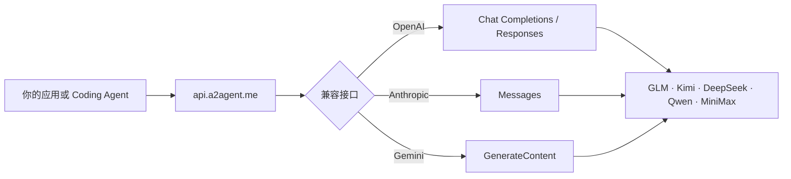

<div align="center">

# ⚡ A2Agent

### 一个 API，连接 GLM、Kimi、DeepSeek、Qwen 和 MiniMax

使用兼容 OpenAI、Anthropic 或 Gemini 的接口构建应用，无需为每个模型提供商重写客户端。

[English](README.md) · [简体中文](README.zh-CN.md) · [日本語](README.ja.md) · [한국어](README.ko.md)

[](https://a2agent.me/)
[](https://docs.a2agent.me/)
[](https://a2agent.me/models)
[](https://a2agent.me/status)

<br/>

[](https://a2agent.me/)

<br/>

**一个密钥 · 三种 API 格式 · 五个模型家族 · 一个实时目录**

[获取 API Key](https://a2agent.me/dashboard) · [浏览模型](https://a2agent.me/models) · [比较价格](https://a2agent.me/pricing)

</div>

<table>
  <tr>
    <td align="right"><b>🚀 开始</b></td>
    <td align="center"><a href="#quick-start">快速开始</a></td>
    <td align="center"><a href="https://a2agent.me/models">模型目录</a></td>
    <td align="center"><a href="https://a2agent.me/pricing">定价</a></td>
  </tr>
  <tr>
    <td align="right"><b>🧭 了解</b></td>
    <td align="center"><a href="#why-a2agent">为什么选择 A2Agent</a></td>
    <td align="center"><a href="#how-it-works">工作方式</a></td>
    <td align="center"><a href="#model-families">模型家族</a></td>
  </tr>
  <tr>
    <td align="right"><b>🔌 开发</b></td>
    <td align="center"><a href="#compatible-interfaces">兼容接口</a></td>
    <td align="center"><a href="#coding-agent-integrations">Coding Agent 集成</a></td>
    <td align="center"><a href="https://docs.a2agent.me/">开发文档</a></td>
  </tr>
  <tr>
    <td align="right"><b>🛡️ 信任</b></td>
    <td align="center"><a href="https://a2agent.me/status">服务状态</a></td>
    <td align="center"><a href="https://a2agent.me/privacy">隐私政策</a></td>
    <td align="center"><a href="#trust-and-operations">运营与安全</a></td>
  </tr>
</table>

## ✨ A2Agent 为你提供什么

| 统一端点 | 熟悉的接口 | 实时信息 | 面向 Agent |
| --- | --- | --- | --- |
| 通过 `https://api.a2agent.me` 访问支持的模型 | OpenAI Chat Completions 与 Responses、Anthropic Messages、Gemini GenerateContent | 公开的模型能力、当前价格和服务状态 | 为常用 Coding Agent 和 API 客户端提供配置教程 |

- **切换模型，不必更换 SDK。** 保留应用已经使用的客户端，只需选择受支持的模型 ID。
- **无需最低消费。** 按量付费适合个人开发者；企业方案面向更高并发和用量需求。
- **上线前即可核实。** 从公开页面查询模型上下文、能力、输入/输出价格和渠道状态。
- **凭据管理更简单。** 使用一个 A2Agent API Key，并将其保存在环境变量或凭据管理器中。

> [!NOTE]
> A2Agent 是 Omnimodel Technology Limited 提供的多模型 API 网关，与 Agent2Agent（A2A）协议没有关联。

<a id="why-a2agent"></a>

## 🤔 为什么选择 A2Agent？

| 常见问题 | 使用 A2Agent |
| --- | --- |
| 不同提供商使用不同 SDK 和请求格式 | 统一使用兼容 OpenAI、Anthropic 或 Gemini 的接口 |
| 更换模型意味着修改应用代码 | 保持同一个端点，只需选择另一个受支持的模型 ID |
| 价格和可用状态分散在多个平台 | 通过公开的[模型目录](https://a2agent.me/models)、[定价](https://a2agent.me/pricing)和[状态](https://a2agent.me/status)页面查询 |
| 不同 Coding 工具需要分别研究配置 | 提供 Claude Code、Codex CLI、Cline、Roo Code、Kilo Code 和 Cursor 的专门教程 |
| 生产团队需要的不只是原始模型端点 | 企业方案提供更高并发、请求频率、批量价格和支持选项 |

<a id="how-it-works"></a>

## 🔄 工作方式



1. 在[控制台](https://a2agent.me/dashboard)注册并创建 API Key。
2. 将现有客户端指向 `https://api.a2agent.me`。
3. 从[实时模型目录](https://a2agent.me/models)选择当前可用的模型 ID。
4. 发送请求，并通过[状态页面](https://a2agent.me/status)查看服务情况。

<a id="model-families"></a>

## 🧠 模型家族

| 模型家族 | 适用场景 | 查看 |
| --- | --- | --- |
| **Z.ai 的 GLM** | 编程、推理、Agent 和通用对话 | [查看 GLM 模型](https://a2agent.me/models) |
| **Moonshot AI 的 Kimi** | 长上下文、编程和 Agent 工作流 | [查看 Kimi 模型](https://a2agent.me/models) |
| **DeepSeek** | 推理和注重成本的通用任务 | [查看 DeepSeek 模型](https://a2agent.me/models) |
| **阿里云的 Qwen** | 多语言、视觉、推理和通用对话 | [查看 Qwen 模型](https://a2agent.me/models) |
| **MiniMax** | Agent、推理和长上下文任务 | [查看 MiniMax 模型](https://a2agent.me/models) |

模型可用性、上下文长度、能力和价格可能变化，请以[实时模型目录](https://a2agent.me/models)和[定价页面](https://a2agent.me/pricing)为准。

<a id="quick-start"></a>

## ⚡ 快速开始

创建 API Key 后，发送第一个兼容 OpenAI 的请求：

```bash
curl https://api.a2agent.me/v1/chat/completions \
  -H "Authorization: Bearer YOUR_A2AGENT_KEY" \
  -H "Content-Type: application/json" \
  -d '{
    "model": "YOUR_MODEL_ID",
    "messages": [{"role": "user", "content": "请解释这段代码。"}]
  }'
```

查询当前账号可以使用的模型 ID：

```bash
curl https://api.a2agent.me/v1/models \
  -H "Authorization: Bearer YOUR_A2AGENT_KEY"
```

<details>
<summary><b>使用 OpenAI SDK 的 Python 示例</b></summary>

```python
import os
from openai import OpenAI

client = OpenAI(
    api_key=os.environ["A2AGENT_API_KEY"],
    base_url="https://api.a2agent.me/v1",
)

response = client.chat.completions.create(
    model="YOUR_MODEL_ID",
    messages=[{"role": "user", "content": "你好，A2Agent！"}],
)

print(response.choices[0].message.content)
```

</details>

<details>
<summary><b>使用 OpenAI SDK 的 Node.js 示例</b></summary>

```javascript
import OpenAI from "openai";

const client = new OpenAI({
  apiKey: process.env.A2AGENT_API_KEY,
  baseURL: "https://api.a2agent.me/v1",
});

const response = await client.chat.completions.create({
  model: "YOUR_MODEL_ID",
  messages: [{ role: "user", content: "你好，A2Agent！" }],
});

console.log(response.choices[0].message.content);
```

</details>

<a id="compatible-interfaces"></a>

## 🔌 兼容接口

| 接口 | 端点 | 常用客户端 |
| --- | --- | --- |
| OpenAI Chat Completions | `POST /v1/chat/completions` | OpenAI SDK、Cline、Roo Code、Kilo Code、Cursor |
| OpenAI Responses | `POST /v1/responses` | Codex CLI 和兼容 Responses API 的应用 |
| Anthropic Messages | `POST /v1/messages` | Claude Code 和兼容 Anthropic 的应用 |
| Gemini GenerateContent | `POST /v1beta/models/{model}:generateContent` | 兼容 Gemini 的应用 |
| 模型发现 | `GET /v1/models` | 需要动态获取模型列表的客户端 |

流式响应、工具调用、视觉及其他能力取决于所选模型和上游平台，请在[模型目录](https://a2agent.me/models)中确认所需能力。

<a id="coding-agent-integrations"></a>

## 🤖 Coding Agent 集成

<table>
  <tr>
    <td width="33%"><b>Claude Code</b><br/>兼容 Anthropic Messages 的配置。<br/><a href="https://a2agent.me/integrations/claude-code">打开教程 →</a></td>
    <td width="33%"><b>Codex CLI</b><br/>OpenAI Responses API 配置。<br/><a href="https://a2agent.me/integrations/codex-cli">打开教程 →</a></td>
    <td width="33%"><b>Cline</b><br/>兼容 OpenAI 的提供商配置。<br/><a href="https://a2agent.me/integrations/cline">打开教程 →</a></td>
  </tr>
  <tr>
    <td><b>Roo Code</b><br/>自定义提供商配置。<br/><a href="https://a2agent.me/integrations/roo-code">打开教程 →</a></td>
    <td><b>Kilo Code</b><br/>兼容 OpenAI 的配置。<br/><a href="https://a2agent.me/integrations/kilo-code">打开教程 →</a></td>
    <td><b>Cursor</b><br/>自定义 API 端点配置。<br/><a href="https://a2agent.me/integrations/cursor">打开教程 →</a></td>
  </tr>
</table>

版本化示例和兼容性测试请访问 [`A2agent-ai/a2agent-integrations`](https://github.com/A2agent-ai/a2agent-integrations)。

<a id="trust-and-operations"></a>

## 🛡️ 运营、安全与信任

| 项目 | 已公开的信息 |
| --- | --- |
| **服务健康状态** | [状态页面](https://a2agent.me/status)提供当前运行状态、延迟和历史可用率 |
| **隐私** | 常规 API 流量的请求和响应正文不会被有意持久化，但官方政策所列的情况可能例外。请阅读[隐私政策](https://a2agent.me/privacy) |
| **计费** | 当前模型费率和计费说明发布在[定价页面](https://a2agent.me/pricing) |
| **法律条款** | 使用前请阅读[服务条款](https://a2agent.me/terms)和[退款政策](https://a2agent.me/refund-policy) |
| **安全** | 切勿提交 API Key。安全漏洞请按照 [`SECURITY.md`](https://github.com/A2agent-ai/a2agent-integrations/blob/main/SECURITY.md) 中的私下报告流程处理 |

## 🏗️ 选择适合你的方案

| 个人开发者 | 团队与企业 |
| --- | --- |
| 按量付费 | 批量价格选项 |
| 无最低消费 | 更高并发和请求频率选项 |
| 公开集成教程 | 集成和兼容性支持 |
| 实时模型、价格和状态 | 通过 [About 页面](https://a2agent.me/about)联系团队 |

## 📚 资源导航

| 了解产品 | 开始开发 | 运营与合规 |
| --- | --- | --- |
| [什么是 A2Agent？](https://a2agent.me/what-is-a2agent) | [开发文档](https://docs.a2agent.me/) | [服务状态](https://a2agent.me/status) |
| [模型目录](https://a2agent.me/models) | [集成教程](https://a2agent.me/integrations) | [隐私政策](https://a2agent.me/privacy) |
| [定价](https://a2agent.me/pricing) | [集成仓库](https://github.com/A2agent-ai/a2agent-integrations) | [服务条款](https://a2agent.me/terms) |
| [博客](https://a2agent.me/blog) | [llms.txt](https://a2agent.me/llms.txt) · [llms-full.txt](https://a2agent.me/llms-full.txt) | [退款政策](https://a2agent.me/refund-policy) |

## 🤝 合作伙伴与社区

A2Agent 与开源维护者、Coding Agent 团队、API 工具和开发者社区合作。推荐与合作信息请查看[合作伙伴计划](https://a2agent.me/partners)。

- 技术集成问题和文档修正：[GitHub Issues](https://github.com/A2agent-ai/a2agent-integrations/issues)
- 账号与账单支持：使用 [About 页面](https://a2agent.me/about)列出的联系渠道
- 产品更新和技术文章：[A2Agent 博客](https://a2agent.me/blog)

<div align="center">

### 通过你已经熟悉的接口，使用适合任务的模型。

[](https://a2agent.me/dashboard)

[](https://github.com/A2agent-ai/A2agent-ai)

<sub>MIT License · © A2Agent contributors</sub>

</div>
