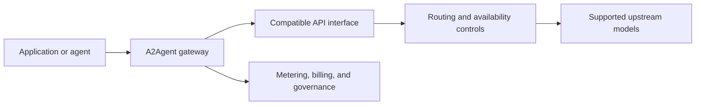

# What is A2Agent?

A2Agent is a unified multi-model API gateway and agent connectivity layer built by Omnimodel Technology Limited.

It places one connection point in front of multiple model providers. Applications and agents can use one API key and familiar OpenAI-compatible or Anthropic Messages interfaces, while A2Agent adds routing, usage metering, billing, and governance around the upstream models.

> This repository document reflects the public product page reviewed on **September 18, 2026**. Capabilities and availability may change. The live [What is A2Agent?](https://a2agent.me/what-is-a2agent) page and published service terms are authoritative.

## Contents

- [The problem A2Agent solves](#the-problem-a2agent-solves)
- [Who A2Agent is for](#who-a2agent-is-for)
- [How A2Agent works](#how-a2agent-works)
- [A practical example](#a-practical-example)
- [What A2Agent is not](#what-a2agent-is-not)
- [A2Agent and A2A](#a2agent-and-a2a)

## The problem A2Agent solves

As AI systems move from a single chat model toward agent workflows, teams need a reliable connection layer between applications and model providers.

| Problem | Why it matters |
| --- | --- |
| **Fragmented integration** | Providers differ in authentication, model names, API formats, context limits, and error behavior. |
| **Unstable availability** | A failure in one account, route, or provider can interrupt an entire agent workflow. |
| **Unobservable costs** | Input tokens, output tokens, and model selection must be mapped back to real usage and billing. |
| **Missing governance** | Production teams need controls such as quotas, concurrency limits, budget alerts, key rotation, and audit logs. |

A2Agent provides a shared gateway so a team can integrate once, reach multiple upstream models, and manage usage through one layer.

## Who A2Agent is for

| Audience | Typical need |
| --- | --- |
| **Engineering teams and AI SaaS companies** | A governed and metered channel for multiple models. |
| **Individual developers and students** | Pay-as-you-go access to supported GLM, Kimi, DeepSeek, Qwen, and MiniMax models. |
| **Agent, RAG, and workflow builders** | OpenAI-compatible or Anthropic Messages endpoints that work with existing clients. |
| **Ecosystem partners** | A unified interface for distribution, integration, and joint delivery. |

## How A2Agent works

Existing clients point their `base_url` and `api_key` at A2Agent instead of integrating separately with every provider.

### Plug in

1. **Connect** — change the client's `base_url` and `api_key` to the A2Agent endpoint.
2. **Interoperate** — use an OpenAI-compatible endpoint or the Anthropic Messages protocol with supported clients.

### Run traffic

3. **Aggregate** — select from supported GLM, Kimi, DeepSeek, Qwen, MiniMax, and other available provider channels.
4. **Route** — platform routing can use account pools, health checks, session stickiness, rate limits, retries, and failover.

### Control and host

5. **Meter** — input and output usage is measured separately, with balances and model-level billing visible to the account.
6. **Govern** — team-oriented controls can include permissions, quotas, budget alerts, audit logs, and SLA support.
7. **Deploy** — the public product page describes both the hosted service and private deployment options; availability depends on the applicable plan and agreement.

## A practical example

A coding assistant may need fast conversation for one task, long-context reasoning for another, and deeper reasoning for a third.

Without a gateway, a team must maintain multiple provider accounts, SDK integrations, and billing records. With A2Agent, the assistant keeps its existing compatible client and changes the gateway URL and API key. The team selects an available model, while supported retry and failover behavior is handled by the platform. Usage and model-level costs remain visible in one console.

The same pattern can apply to RAG systems, workflow automation, and multi-step agent pipelines when the client uses a supported API format and the required model is available.

## What A2Agent is not

- **Not a foundation model.** A2Agent does not train the upstream models.
- **Not an agent builder.** It does not implement an agent's internal reasoning or replace a workflow engine.
- **Not the Agent2Agent protocol.** A2Agent is a gateway product, not the A2A protocol or specification.
- **Not a promise of universal compatibility.** Every upstream model remains subject to its own availability, capabilities, terms, and provider policies.

## A2Agent and A2A

| Term | Meaning |
| --- | --- |
| **A2A** | Agent-to-Agent: the broader goal of reliable connectivity and collaboration between agents and other systems. |
| **A2Agent** | The gateway product that provides unified model access, routing, metering, governance, and billing for agent-facing workloads. |

A2Agent can serve as a model-access entry point in an A2A architecture, but it is not itself the A2A protocol.

## Continue exploring

- [Live model catalog](https://a2agent.me/models)
- [Current pricing](https://a2agent.me/pricing)
- [Integration guides](https://a2agent.me/integrations)
- [Developer documentation](https://docs.a2agent.me/)
- [Service status](https://a2agent.me/status)
- [Privacy Policy](https://a2agent.me/privacy) and [Terms of Service](https://a2agent.me/terms)

[Back to the main README](README.md)
